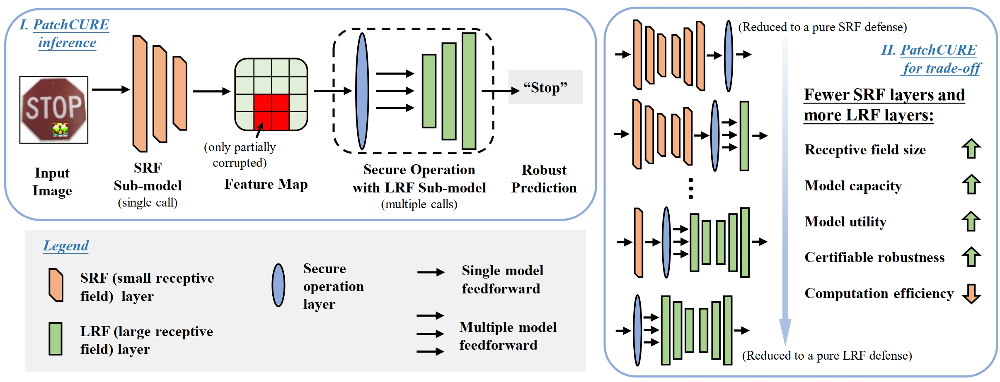
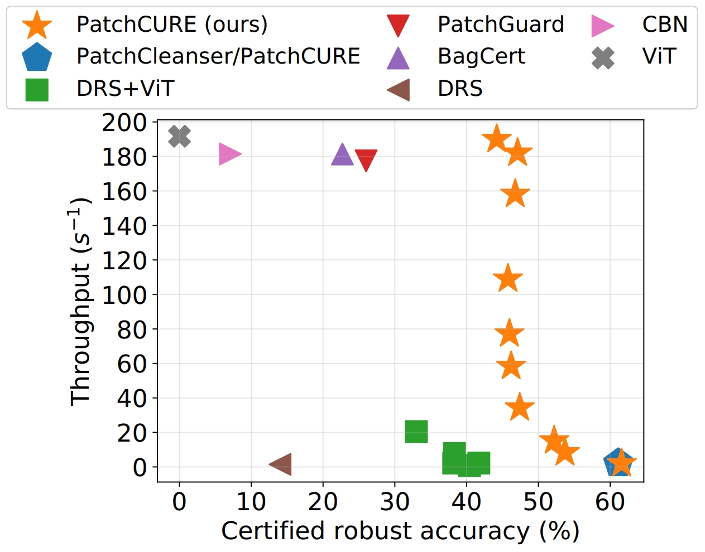

# PatchCURE: Improving Certifiable Robustness, Model Utility, and Computation Efficiency of Adversarial Patch Defenses

Code for "[PatchCURE: Improving Certifiable Robustness, Model Utility, and Computation Efficiency of Adversarial Patch Defenses](https://arxiv.org/abs/2310.13076)" in USENIX Security Symposium 2024. 

**Update 04/2024**: Released code and model checkpoints.

### Overview



### Main results



#### Check out our [paper list for adversarial patch research](https://github.com/xiangchong1/adv-patch-paper-list) and [leaderboard for certifiable robust image classification](https://github.com/inspire-group/patch-defense-leaderboard) for fun!

## Dependency

Tested with `torch==1.13.1` and `timm==0.9.16`. This repository should be compatible with newer version of packages. `requirements.txt` lists other required packages (with version numbers commented out).

## Files

```shell
├── README.md                        # this file 
├── requirements.txt                 # required packages
├── example_cmds.sh                  # command to reproduce PatchCURE results reported in the paper
├── reproducibility.md               # detailed guide for experiments. used for artifact evaluation at USENIX Security 
├── get_imagenet_val.sh              # script for downloading ImageNet val dataset.  
| 
├── main.py                          # PatchCURE entry point.  
| 
├── utils
|   ├── builder.py                   # utils for building models and getting data loaders
|   ├── pcure.py                     # utils for PatchCURE inference algorithms 
|   ├── split.py                     # utils for splitting models into sub-models for PatchCURE construction
|   ├── bagnet.py                    # BagNet model; adapted from https://github.com/wielandbrendel/bag-of-local-features-models/blob/master/bagnets/pytorchnet.py
|   └── vit_srf.py                   # ViT-SRF model; based on timm/models/vision_transformer.py 
|
| 
├── data   
|   └── imagenet                     # data directory for imagenet # use torchvision.datasets.ImageFolder
|
└── checkpoints                      # directory for checkpoints
    ├── README.md                    # details of checkpoints
    └── ...                          # model checkpoints
```

## Dataset

- [ImageNet](https://image-net.org/download.php) (ILSVRC2012). 

## Getting Started

1. See **Files** for details of each file. 
2. Download data in **Datasets** to `data/`.
3. Read [`checkpoints/README.md`](checkpoints/README.md) and download checkpoints from Google Drive [link](https://drive.google.com/drive/folders/146Qy-FKgSKrzuaaSluafhm3jYDQzYERj?usp=sharing) and move them to `checkpoints`.
4. See [`example_cmd.sh`](example_cmds.sh) for example commands for running the code and reproducing PatchCURE results reported in the paper.
5. See `reproducibility.md` for a more detailed guide for running experiments. It was used for artifact evaluation in USENIX Security.

If anything is unclear, please open an issue or contact Chong Xiang (cxiang@princeton.edu).

## Citation

If you find our work useful in your research, please consider citing:

```tex
@inproceedings{xiang2024patchcure,
  title={PatchCURE: Improving Certifiable Robustness, Model Utility, and Computation Efficiency of Adversarial Patch Defenses},
  author={Xiang, Chong and Wu, Tong and Dai, Sihui and Petit, Jonathan and Jana, Suman and Mittal, Prateek},
  booktitle = {33rd {USENIX} Security Symposium ({USENIX} Security)},
  year={2024}
}
```
